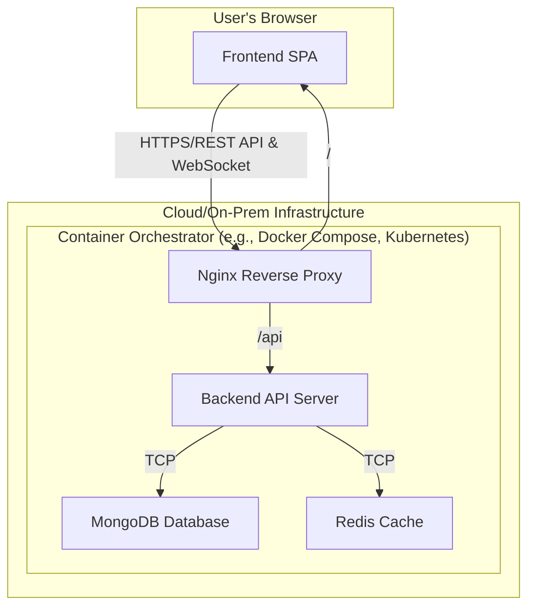

# Architecture Overview

## 1. Architecture Style

The system is designed with a **Stateless, Modular Microservices Architecture**. The frontend and backend are separate, containerized services that communicate via a REST API. This allows for horizontal scalability and maintainability. Shared state is managed externally in Redis.

## 2. Components

| Component | Description | Technology |
| :--- | :--- | :--- |
| **Frontend** | A single-page application (SPA) that provides the real-time monitoring and configuration UI. | React, Vite |
| **Backend** | A Node.js server that acts as the gateway, processing requests and exposing a management API. | Node.js, Express |
| **Database** | A MongoDB instance for persistent storage of logs, analytics, and configuration. | MongoDB |
| **Cache** | A Redis instance for high-speed, shared state management (rate limits, circuit states). | Redis |
| **Web Server** | Nginx is used as a reverse proxy and for serving static frontend assets in production. | Nginx |

## 3. Interaction Map



## 4. Data Flow

```
Client → Gateway → RateLimiter → CircuitBreaker → Backend
                     ↓
                  Logger → DB
                     ↓
                Analytics → Dashboard (via WebSocket)
```
