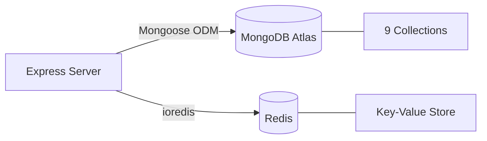
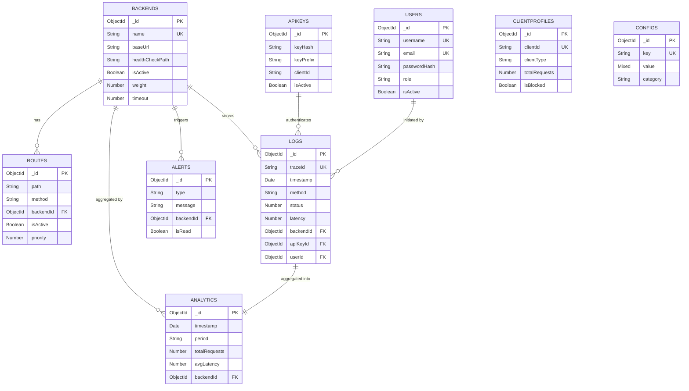
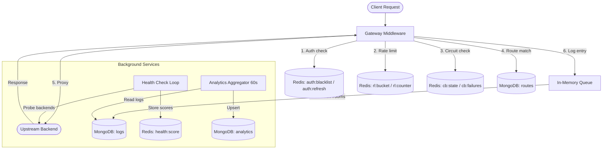

# Gatekeeper — Database Design Document

> **Project:** Gatekeeper API Gateway  
> **Version:** 1.0.0  
> **Last Updated:** 2026-02-26  
> **Databases:** MongoDB (primary store) · Redis (caching & state)

---

## 1. Architecture Overview

Gatekeeper uses a **dual-database architecture**:

| Layer | Technology | Role |
|-------|-----------|------|
| **Primary Store** | MongoDB (Atlas, Mongoose ODM) | Persistent storage for all domain entities, logs, analytics, and configuration |
| **Transient State** | Redis (ioredis) | Rate limiting, circuit breaker state, health scores, metrics cache, auth tokens |

### Connection Strategy

- **MongoDB**: Connects via Mongoose with Stable API v1. Falls back to native `MongoClient` driver on Mongoose failure. Configured with 5 s server-selection timeout and 45 s socket timeout.
- **Redis**: Uses ioredis with lazy connect, 5 s timeout, and zero retries. The server operates in **fail-open** mode — all Redis-dependent features degrade gracefully when Redis is unreachable.

---

## 2. MongoDB Collections

### 2.1 `users`

Stores dashboard administrator and viewer accounts.

| Field | Type | Required | Constraints | Description |
|-------|------|----------|-------------|-------------|
| `_id` | ObjectId | auto | PK | |
| `username` | String | ✅ | unique, trimmed, lowercase | Login identifier |
| `email` | String | ✅ | unique, trimmed, lowercase, regex-validated | User email |
| `passwordHash` | String | ✅ | | bcrypt hash (12 rounds) |
| `role` | String | ✅ | enum: `admin`, `viewer` (default: `viewer`) | Access level |
| `isActive` | Boolean | ✅ | default: `true` | Soft-delete flag |
| `lastLogin` | Date | | | Timestamp of most recent login |
| `avatar.data` | String | | | Base64-encoded image data |
| `avatar.mimeType` | String | | enum: `image/png`, `image/jpeg`, `image/webp` | Avatar format |
| `avatar.updatedAt` | Date | | | Avatar upload time |
| `preferences.emailAlerts` | Boolean | | default: `true` | Receive email alerts |
| `preferences.liveDashboard` | Boolean | | default: `true` | Enable live dashboard |
| `preferences.compactTables` | Boolean | | default: `false` | Compact table view |
| `createdAt` | Date | auto | Mongoose timestamps | |
| `updatedAt` | Date | auto | Mongoose timestamps | |

**Indexes:** `username` (unique), `email` (unique)

---

### 2.2 `backends`

Registered upstream services that the gateway proxies traffic to.

| Field | Type | Required | Constraints | Description |
|-------|------|----------|-------------|-------------|
| `_id` | ObjectId | auto | PK | |
| `name` | String | ✅ | unique | Human-readable backend name |
| `baseUrl` | String | ✅ | | Upstream base URL (e.g. `http://service:3000`) |
| `healthCheckPath` | String | | default: `/health` | Endpoint probed by health-check service |
| `isActive` | Boolean | ✅ | default: `true` | Whether backend receives traffic |
| `weight` | Number | | default: `1` | Load-balancing weight |
| `timeout` | Number | | default: `5000` | Request timeout in ms |
| `tags` | [String] | | | Arbitrary labels for grouping |
| `createdAt` | Date | auto | Mongoose timestamps | |
| `updatedAt` | Date | auto | Mongoose timestamps | |

**Indexes:** `name` (unique)

---

### 2.3 `routes`

Maps incoming request paths/methods to backend services.

| Field | Type | Required | Constraints | Description |
|-------|------|----------|-------------|-------------|
| `_id` | ObjectId | auto | PK | |
| `path` | String | ✅ | | URL path pattern (e.g. `/api/v1/*`) |
| `method` | String | ✅ | enum: `GET`, `POST`, `PUT`, `DELETE`, `PATCH`, `*` | HTTP method filter |
| `backendId` | ObjectId | ✅ | ref → `backends` | Target backend |
| `stripPrefix` | String | | | Path prefix to remove before forwarding |
| `addPrefix` | String | | | Path prefix to prepend before forwarding |
| `injectHeaders` | Map\<String\> | | | Custom headers injected into proxied requests |
| `isActive` | Boolean | ✅ | default: `true` | Route enabled flag |
| `requiresAuth` | Boolean | ✅ | default: `false` | Require API key authentication |
| `rateLimit` | Number | | | Per-route requests-per-minute override |
| `priority` | Number | | default: `0` | Route matching priority (higher = first) |
| `createdAt` | Date | auto | Mongoose timestamps | |
| `updatedAt` | Date | auto | Mongoose timestamps | |

**Indexes:** `{ path: 1, method: 1 }` (compound), `{ backendId: 1 }`

---

### 2.4 `apikeys`

API key credentials for client authentication at the gateway.

| Field | Type | Required | Constraints | Description |
|-------|------|----------|-------------|-------------|
| `_id` | ObjectId | auto | PK | |
| `keyHash` | String | ✅ | | SHA-256 hash of the full API key |
| `keyPrefix` | String | ✅ | | First 8 chars of the key for identification |
| `name` | String | ✅ | | Friendly label (e.g. "Mobile App Key") |
| `clientId` | String | ✅ | | Logical client identifier |
| `scopes` | [String] | | | Permission scopes (e.g. `["read", "write"]`) |
| `rateLimit` | Number | | | Per-key requests-per-minute override |
| `isActive` | Boolean | ✅ | default: `true` | Key enabled flag |
| `expiresAt` | Date | | | Key expiration timestamp |
| `lastUsedAt` | Date | | | Last request timestamp using this key |
| `createdAt` | Date | auto | Mongoose timestamps | |
| `updatedAt` | Date | auto | Mongoose timestamps | |

**Indexes:** `{ keyPrefix: 1 }`, `{ clientId: 1 }`

---

### 2.5 `logs`

Individual API gateway request/response log entries.

| Field | Type | Required | Constraints | Description |
|-------|------|----------|-------------|-------------|
| `_id` | ObjectId | auto | PK | |
| `traceId` | String | ✅ | unique | Unique request trace identifier |
| `timestamp` | Date | ✅ | default: `Date.now` | Request timestamp |
| `method` | String | ✅ | | HTTP method (GET, POST, etc.) |
| `endpoint` | String | ✅ | | Requested URL path |
| `status` | Number | ✅ | | HTTP response status code |
| `latency` | Number | ✅ | | Total response time in ms |
| `gatewayOverhead` | Number | | | Gateway processing time in ms |
| `clientIp` | String | ✅ | | Requesting client IP address |
| `backendId` | ObjectId | | ref → `backends` | Backend that served the request |
| `apiKeyId` | ObjectId | | ref → `apikeys` | API key used (if authenticated) |
| `userId` | ObjectId | | ref → `users` | Associated user (if applicable) |
| `errorMessage` | String | | | Error description for failed requests |
| `requestSize` | Number | | | Request body size in bytes |
| `responseSize` | Number | | | Response body size in bytes |

**Indexes:**
- `{ timestamp: 1 }` — TTL index, **auto-deletes documents after 30 days**
- `{ clientIp: 1 }`
- `{ status: 1 }`

**Write Pattern:** Logs are batched via an in-memory queue (`logQueue.js`) and flushed every 750 ms in batches of 200 using `insertMany({ ordered: false })`. Queue capacity is capped at 5,000 entries.

---

### 2.6 `analytics`

Pre-aggregated time-series metrics computed from `logs`.

| Field | Type | Required | Constraints | Description |
|-------|------|----------|-------------|-------------|
| `_id` | ObjectId | auto | PK | |
| `timestamp` | Date | ✅ | | Bucket start time |
| `period` | String | ✅ | enum: `minute`, `hour`, `day` | Aggregation granularity |
| `totalRequests` | Number | ✅ | | Total requests in period |
| `successCount` | Number | ✅ | | 2xx/3xx responses |
| `errorCount` | Number | ✅ | | 4xx/5xx responses |
| `avgLatency` | Number | ✅ | | Average latency in ms |
| `p50Latency` | Number | | | 50th percentile latency |
| `p95Latency` | Number | | | 95th percentile latency |
| `p99Latency` | Number | | | 99th percentile latency |
| `throughput` | Number | | | Requests per second |
| `backendId` | ObjectId | | ref → `backends` | Scoped backend (null = global) |
| `createdAt` | Date | auto | Mongoose timestamps (createdAt only) | |

**Indexes:** `{ timestamp: 1, period: 1 }` (compound), `{ backendId: 1 }`

**Write Pattern:** The `analyticsAggregator.js` service runs every 60 seconds, computes minute/hour/day buckets from the `logs` collection, and upserts results into `analytics`.

---

### 2.7 `alerts`

System-generated notifications for operational events.

| Field | Type | Required | Constraints | Description |
|-------|------|----------|-------------|-------------|
| `_id` | ObjectId | auto | PK | |
| `type` | String | ✅ | enum: `error`, `warning`, `info` | Alert severity |
| `message` | String | ✅ | | Human-readable alert message |
| `source` | String | ✅ | | Originating subsystem |
| `backendId` | ObjectId | | ref → `backends` | Related backend (if applicable) |
| `isRead` | Boolean | ✅ | default: `false` | Read/unread status |
| `resolvedAt` | Date | | | When the alert was resolved |
| `metadata` | Mixed | | | Arbitrary additional data |
| `createdAt` | Date | auto | Mongoose timestamps (createdAt only) | |

**Indexes:** `{ type: 1 }`, `{ isRead: 1 }`, `{ createdAt: 1 }`

---

### 2.8 `clientprofiles`

Aggregated identity profiles for API consumers (by IP or API key).

| Field | Type | Required | Constraints | Description |
|-------|------|----------|-------------|-------------|
| `_id` | ObjectId | auto | PK | |
| `clientId` | String | ✅ | unique | IP address or API key client identifier |
| `clientType` | String | ✅ | enum: `ip`, `apikey` | Identity type |
| `totalRequests` | Number | ✅ | default: `0` | Lifetime request count |
| `blockedRequests` | Number | ✅ | default: `0` | Lifetime blocked (rate-limited) count |
| `avgLatency` | Number | | | Average response latency in ms |
| `lastSeen` | Date | | | Last request timestamp |
| `isBlocked` | Boolean | ✅ | default: `false` | Manually blocked flag |
| `customRateLimit` | Number | | | Per-client requests-per-minute override |
| `notes` | String | | | Admin notes |
| `createdAt` | Date | auto | Mongoose timestamps | |
| `updatedAt` | Date | auto | Mongoose timestamps | |

**Indexes:** `clientId` (unique)

---

### 2.9 `configs`

Dynamic runtime configuration stored in the database (key-value store).

| Field | Type | Required | Constraints | Description |
|-------|------|----------|-------------|-------------|
| `_id` | ObjectId | auto | PK | |
| `key` | String | ✅ | unique | Dot-notation config key |
| `value` | Mixed | ✅ | | Config value (number, string, object, array) |
| `description` | String | | | Human-readable description |
| `category` | String | ✅ | enum: `rate_limiting`, `circuit_breaker`, `routing`, `security`, `general`, `alerts` | Grouping category |
| `isActive` | Boolean | ✅ | default: `true` | Whether config is active |
| `updatedBy` | String | | | Username of last modifier |
| `createdAt` | Date | auto | Mongoose timestamps | |
| `updatedAt` | Date | auto | Mongoose timestamps | |

**Indexes:** `{ category: 1 }`

**Seeded Defaults:**

| Key | Default Value | Category |
|-----|--------------|----------|
| `rate_limiting.default_rpm` | `100` | rate_limiting |
| `rate_limiting.burst_multiplier` | `1.5` | rate_limiting |
| `rate_limiting.manual_override_enabled` | `false` | rate_limiting |
| `rate_limiting.manual_override_rpm` | `0` | rate_limiting |
| `circuit_breaker.failure_threshold` | `5` | circuit_breaker |
| `circuit_breaker.recovery_timeout_ms` | `30000` | circuit_breaker |
| `circuit_breaker.half_open_max_calls` | `3` | circuit_breaker |
| `routing.health_check_interval_ms` | `30000` | routing |
| `routing.custom_headers` | `{}` | routing |
| `security.jwt_expiry` | `3600` | security |
| `security.api_key_header` | `x-api-key` | security |
| `alerts.email` | `""` | alerts |
| `alerts.webhook` | `""` | alerts |
| `alerts.rules` | `[{name, enabled}, ...]` | alerts |

---

## 3. Entity-Relationship Diagram

---

## 4. Redis Key Schema

Redis is used exclusively for **transient, high-frequency state**. All keys are generated through the centralized `redisKeys.js` helper.

### 4.1 Rate Limiting

| Key Pattern | Type | TTL | Description |
|------------|------|-----|-------------|
| `rl:bucket:{clientId}` | String (JSON) | Dynamic (≥ 120 s) | Token bucket state: `{ tokens: number, lastRefill: timestamp }` |
| `rl:counter:{clientId}` | String (counter) | 60 s | Per-minute request counter for observability |

### 4.2 Circuit Breaker

| Key Pattern | Type | TTL | Description |
|------------|------|-----|-------------|
| `cb:state:{backendName}` | String | none | Current state: `CLOSED`, `OPEN`, or `HALF_OPEN` |
| `cb:failures:{backendName}` | String (counter) | none | Consecutive failure count |
| `cb:lastfail:{backendName}` | String (timestamp) | none | Epoch ms of last failure |
| `cb:halfopen:calls:{backendName}` | String (counter) | 60 s | Probe calls during HALF_OPEN state |

### 4.3 Health Monitoring

| Key Pattern | Type | TTL | Description |
|------------|------|-----|-------------|
| `health:score:{backendName}` | String (0-100) | none | Current health score from last probe |
| `health:lastcheck:{backendName}` | String (ISO date) | none | Timestamp of last health check |

### 4.4 Metrics Cache

| Key Pattern | Type | TTL | Description |
|------------|------|-----|-------------|
| `metrics:cache:{period}` | String (JSON) | varies | Cached analytics query results |
| `metrics:overview` | String (JSON) | varies | Cached dashboard overview data |
| `metrics:checkpoint:{period}` | String | varies | Aggregation checkpoint marker |

### 4.5 Authentication

| Key Pattern | Type | TTL | Description |
|------------|------|-----|-------------|
| `auth:blacklist:{jti}` | String | matches JWT expiry | Revoked JWT token ID |
| `auth:refresh:{userId}` | String | session duration | Refresh token for user |

---

## 5. Data Flow Diagram

---

## 6. Indexing Strategy Summary

| Collection | Index | Type | Purpose |
|------------|-------|------|---------|
| `users` | `username` | Unique | Login lookup |
| `users` | `email` | Unique | Email lookup |
| `backends` | `name` | Unique | Name lookup |
| `routes` | `{ path, method }` | Compound | Route matching |
| `routes` | `backendId` | Single | Backend filter |
| `apikeys` | `keyPrefix` | Single | Fast key lookup |
| `apikeys` | `clientId` | Single | Client filter |
| `logs` | `timestamp` | TTL (30 days) | Auto-expire old logs |
| `logs` | `clientIp` | Single | IP-based filtering |
| `logs` | `status` | Single | Status code filtering |
| `analytics` | `{ timestamp, period }` | Compound | Time-series queries |
| `analytics` | `backendId` | Single | Backend scoped queries |
| `alerts` | `type` | Single | Severity filtering |
| `alerts` | `isRead` | Single | Unread filter |
| `alerts` | `createdAt` | Single | Chronological sorting |
| `configs` | `key` | Unique | Config lookup |
| `configs` | `category` | Single | Category filtering |
| `clientprofiles` | `clientId` | Unique | Client lookup |

---

## 7. Data Retention & Lifecycle

| Data | Retention | Mechanism |
|------|-----------|-----------|
| **Logs** | 30 days | MongoDB TTL index on `timestamp` |
| **Analytics** | Permanent | No auto-deletion; aggregated from logs |
| **Alerts** | Permanent | Manual resolution via `resolvedAt` |
| **Redis rate-limit buckets** | ≥ 120 s (dynamic) | Redis `EX` TTL |
| **Redis rate-limit counters** | 60 s | Redis `EXPIRE` |
| **Redis JWT blacklist** | Matches JWT expiry | Redis `EX` TTL |
| **Redis circuit breaker half-open** | 60 s | Redis `EXPIRE` |

---

## 8. Seed Data

On server startup, `seed.js` creates:

1. **Default admin user** — `admin` / `Admin@1234` (bcrypt-hashed, role: `admin`)
2. **14 default config entries** — covering rate limiting, circuit breaker, routing, security, and alerts categories (see §2.9 table)

Seeding is **idempotent** — existing records are skipped.
