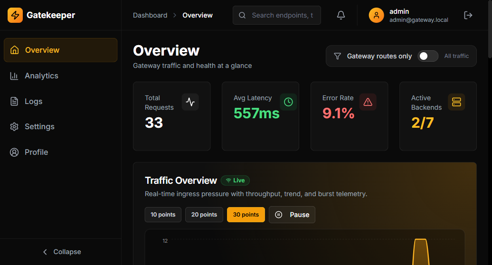

# Intelligent Adaptive API Gateway



A high-performance, self-healing API gateway with intelligent rate limiting, circuit breaking, real-time analytics, and a modern React dashboard. Routes requests to microservices, enforces security policies, and provides centralized monitoring.

Built with **Node.js**, **Express**, **MongoDB**, **Redis**, **React**, and **Socket.io**.

---

## Features

### Gateway Core
- **Request Routing & Proxying** — path-based routing with wildcard support, weighted round-robin load balancing, and header injection (X-Gateway-Id, X-Request-Id, X-Trace-Id)
- **Adaptive Rate Limiting** — Redis-backed token bucket with per-client/IP/API-key limits that dynamically adjust based on backend health and circuit state
- **Circuit Breaker** — three-state (CLOSED → OPEN → HALF\_OPEN) breaker with configurable failure threshold, auto-recovery, and real-time alert notifications
- **Health Monitoring** — periodic HTTP probes with health scores (0–100), status classification (healthy/degraded/unhealthy), and automatic unhealthy-backend exclusion
- **DDoS Protection** — auto-disables routes exceeding a configurable requests-per-minute threshold
- **Distributed Tracing** — W3C Traceparent-compatible trace ID propagation with end-to-end latency measurement
- **Structured Logging** — Winston logger with async MongoDB persistence, 30-day TTL, and per-request structured data
- **Analytics Aggregation** — background aggregation into minute/hour/day buckets with percentile calculations (p50/p95/p99)
- **Client Behavior Profiling** — tracks request patterns, violation counts, and behavior scores with automatic blocking of abusive clients
- **Alert System** — creates alerts for circuit breaker changes, DDoS events, and high error rates; dispatches via dashboard, email (SMTP), and webhooks

### Authentication & Security
- **better-auth** integration with email/password, JWT sessions, and admin roles
- **API Key** authentication with SHA-256 hashing and scoped access
- **Helmet.js** security headers, CORS, input sanitization, and request body size limits

### Real-time Dashboard
- **Socket.io WebSocket** server with /dashboard namespace for live traffic, latency, error, circuit, alert, and log events
- **SSE fallback** for live log streaming
- **Overview** — metric cards, live traffic chart, top endpoints, circuit breaker status, recent alerts
- **Analytics** — KPI cards, latency distribution, method breakdown, endpoint performance, client activity, hourly traffic, error analysis with CSV/JSON export
- **Logs** — filterable, paginated log table with quick filters (errors only, slow requests, last hour), live streaming, trace detail modal, CSV export
- **Settings** — 7 configuration tabs: General, Rate Limiting, Circuit Breakers, Backends, Routes, Security, Alerts
- **Profile** — avatar upload, preferences, password change, account management

---

## Tech Stack

| Layer | Technology |
|-------|-----------|
| Backend | Node.js, Express, Winston |
| Auth | better-auth, JWT, API Keys |
| Database | MongoDB (Mongoose ODM) |
| Cache | Redis (ioredis) |
| Real-time | Socket.io, Server-Sent Events |
| Frontend | React 19, Vite 7, Tailwind CSS 3 |
| UI | Radix UI, Recharts, Framer Motion, Lucide Icons |
| DevOps | Docker, Docker Compose, Nginx (production) |

---

## Quick Start

### Prerequisites
- Node.js 20+
- MongoDB 6+ (running on localhost:27017)
- Redis 7+ (optional — gateway runs in degraded mode without it)

### Local Development

```bash
# 1. Install dependencies
npm install
npm run install:all

# 2. Configure environment
cp backend/.env.example backend/.env
# Edit backend/.env — set BETTER_AUTH_SECRET, MONGODB_URI, etc.

# 3. Start MongoDB (if not running)
mongod --dbpath /data/db --logpath /var/log/mongod.log --logappend --fork

# 4. Start development servers (backend + frontend)
npm run dev
```

The backend runs on **http://localhost:<PORT>** (or the PORT env var) and the frontend on **http://localhost:<PORT>**.

Default admin credentials (seeded on first run):
- **Email:** admin@gateway.local
- **Password:** Admin@1234

### Docker Development

```bash
cd DockerFiles
docker compose -f docker-compose-dev.yml up --build
```

---

## Project Structure

```
├── backend/
│   ├── server.js                    # Entry point (Express + Socket.io)
│   ├── routes/                      # API route handlers
│   │   ├── overview.js              # Dashboard overview endpoints
│   │   ├── analytics.js             # Analytics endpoints
│   │   ├── logs.js                  # Log querying + SSE streaming
│   │   └── settings.js              # Configuration management
│   └── src/
│       ├── config/
│       │   ├── database.js          # MongoDB + Redis connections
│       │   ├── redisKeys.js         # Redis key structure
│       │   └── seed.js              # Database seeding
│       ├── lib/
│       │   └── auth.js              # better-auth integration
│       ├── middleware/
│       │   ├── auth.js              # JWT + API key middleware
│       │   ├── circuitBreaker.js    # Circuit breaker state machine
│       │   ├── errorHandler.js      # Global error handler
│       │   ├── proxy.js             # HTTP reverse proxy
│       │   ├── rateLimit.js         # Adaptive rate limiter
│       │   ├── security.js          # Helmet, CORS, sanitization
│       │   └── validate.js          # Request validation
│       ├── models/                  # Mongoose models
│       │   ├── Alert.js
│       │   ├── Analytics.js
│       │   ├── ApiKey.js
│       │   ├── Backend.js
│       │   ├── ClientProfile.js
│       │   ├── Config.js
│       │   ├── Log.js
│       │   ├── Route.js
│       │   └── User.js
│       ├── routes/
│       │   ├── apiKeys.js           # API key CRUD
│       │   ├── gateway.js           # Gateway catch-all router
│       │   └── user.js              # User profile management
│       ├── services/
│       │   ├── alertService.js      # Alert creation + dispatch
│       │   ├── analyticsAggregator.js
│       │   ├── clientProfiler.js    # Client behavior tracking
│       │   ├── healthCheck.js       # Backend health monitoring
│       │   ├── logQueue.js          # Async log persistence
│       │   └── websocket.js         # Socket.io server
│       └── utils/
│           ├── apiKey.js            # API key generation
│           ├── jwt.js               # JWT utilities
│           ├── logger.js            # Winston logger
│           └── password.js          # bcrypt utilities
├── frontend/
│   ├── src/
│   │   ├── App.jsx                  # Router + providers
│   │   ├── Dashboard/
│   │   │   ├── DashboardLayout.jsx  # Sidebar + TopBar layout
│   │   │   ├── Sidebar.jsx
│   │   │   ├── TopBar.jsx
│   │   │   └── pages/
│   │   │       ├── Overview.jsx
│   │   │       ├── Analytics.jsx
│   │   │       ├── Logs.jsx
│   │   │       ├── Settings.jsx
│   │   │       └── Profile.jsx
│   │   ├── LandingPage/             # Public landing page sections
│   │   ├── pages/                   # Auth pages (Login, Register, etc.)
│   │   ├── components/              # Shared UI components
│   │   ├── context/                 # React contexts (Auth, Toast, Filter)
│   │   ├── hooks/                   # Custom hooks (useApi, useWebSocket)
│   │   ├── lib/                     # Auth client, utilities
│   │   └── utils/                   # API client, export utilities
│   └── vite.config.js
├── temp_servers/                    # Test microservices
├── DockerFiles/                     # Docker configs (dev + prod)
└── package.json                     # Root orchestrator
```

---

## Environment Variables

Create `backend/.env` from `backend/.env.example`:

| Variable | Required | Default | Description |
|----------|----------|---------|-------------|
| `MONGODB_URI` | Yes | — | MongoDB connection string |
| `REDIS_URL` | No | — | Redis connection string (graceful degradation without) |
| `BETTER_AUTH_SECRET` | Yes | — | Auth secret (generate with `openssl rand -base64 32`) |
| `BETTER_AUTH_URL` | Yes | — | Backend base URL for auth |
| `FRONTEND_URL` | Yes | — | Frontend URL for CORS |
| `PORT` | No | 3000 | Backend server port |
| `NODE_ENV` | No | development | Environment mode |
| `API_KEY_HEADER` | No | x\-api\-key | HTTP header name for API keys |
| `ALLOWED_ORIGINS` | No | — | Comma-separated CORS origins |
| `SMTP_HOST` | No | — | SMTP server for email alerts |
| `SMTP_PORT` | No | 587 | SMTP port |
| `SMTP_USER` | No | — | SMTP username |
| `SMTP_PASS` | No | — | SMTP password |
| `SMTP_FROM` | No | — | Email sender address |

---

## API Reference

### Health & Status
| Method | Endpoint | Description |
|--------|----------|-------------|
| GET | `/health` | Simple health check |
| GET | `/api/status` | Detailed status (MongoDB, Redis, uptime) |

### Gateway Proxy
| Method | Endpoint | Description |
|--------|----------|-------------|
| ANY | `/gateway/*` | Proxied to matching backend service |

### Overview
| Method | Endpoint | Description |
|--------|----------|-------------|
| GET | `/api/overview` | Dashboard metrics |
| GET | `/api/overview/traffic` | Traffic data points |
| GET | `/api/overview/traffic/stream` | SSE live traffic stream |
| GET | `/api/overview/endpoints` | Top endpoints |
| GET | `/api/overview/circuit-breakers` | Circuit breaker states |
| POST | `/api/overview/circuit-breakers/:name/trip` | Manually trip breaker |
| POST | `/api/overview/circuit-breakers/:name/reset` | Reset breaker |
| GET | `/api/overview/alerts` | Recent alerts |

### Analytics
| Method | Endpoint | Description |
|--------|----------|-------------|
| GET | `/api/analytics/traffic?range=` | Traffic over time |
| GET | `/api/analytics/endpoints` | Endpoint metrics |
| GET | `/api/analytics/errors?range=` | Error breakdown |
| GET | `/api/analytics/clients` | Client profiles |
| GET | `/api/analytics/analysis?hours=` | Full analysis |

### Logs
| Method | Endpoint | Description |
|--------|----------|-------------|
| GET | `/api/logs` | Paginated logs (query: page, limit, method, status, endpoint, trace\_id, from, to) |
| GET | `/api/logs/stream/live` | SSE live log stream |
| GET | `/api/logs/:traceId` | Log by trace ID |

### Settings & Configuration
| Method | Endpoint | Description |
|--------|----------|-------------|
| GET | `/api/settings` | All settings |
| PUT | `/api/settings` | Update settings |
| GET/PUT | `/api/settings/general` | General settings |
| GET/PUT | `/api/settings/rate-limiting` | Rate limiting config |
| GET/PUT | `/api/settings/circuit-breakers` | Circuit breaker config |
| GET/PUT | `/api/settings/security` | Security settings |
| GET/PUT | `/api/settings/alerts` | Alert settings |

### Backend Management
| Method | Endpoint | Description |
|--------|----------|-------------|
| GET | `/api/settings/backends` | List backends |
| POST | `/api/settings/backends` | Create backend |
| PUT | `/api/settings/backends/:id` | Update backend |
| DELETE | `/api/settings/backends/:id` | Delete backend |

### Route Management
| Method | Endpoint | Description |
|--------|----------|-------------|
| GET | `/api/settings/routes` | List routes |
| POST | `/api/settings/routes` | Create route |
| PUT | `/api/settings/routes/:id` | Update route |
| DELETE | `/api/settings/routes/:id` | Delete route |

### API Key Management
| Method | Endpoint | Description |
|--------|----------|-------------|
| GET | `/api/settings/api-keys` | List API keys |
| POST | `/api/admin/api-keys` | Create API key |
| PATCH | `/api/admin/api-keys/:id/revoke` | Revoke key |
| DELETE | `/api/admin/api-keys/:id` | Delete key |

### Authentication (better-auth)
| Method | Endpoint | Description |
|--------|----------|-------------|
| POST | `/api/auth/sign-up/email` | Register |
| POST | `/api/auth/sign-in/email` | Login |
| POST | `/api/auth/sign-out` | Logout |
| GET | `/api/auth/get-session` | Get session |

### User Profile
| Method | Endpoint | Description |
|--------|----------|-------------|
| GET | `/api/user/me` | Get profile |
| PUT | `/api/user/profile` | Update profile |
| GET/PUT | `/api/user/preferences` | User preferences |
| PUT | `/api/user/avatar` | Upload avatar |

---

## WebSocket Events (Socket.io)

Connect to the `/dashboard` namespace:

| Event | Direction | Description |
|-------|-----------|-------------|
| `traffic:update` | Server → Client | Periodic throughput snapshot (every 1s) |
| `latency:update` | Server → Client | Average latency update |
| `error:new` | Server → Client | New upstream error |
| `circuit:change` | Server → Client | Circuit breaker state transition |
| `alert:new` | Server → Client | New system alert |
| `log:new` | Server → Client | New request log entry |

---

## Database Schema

### MongoDB Collections
| Collection | Purpose |
|-----------|---------|
| `user` | User accounts (managed by better-auth) |
| `session` | Auth sessions (managed by better-auth) |
| `configs` | Dynamic gateway configuration |
| `backends` | Backend service definitions |
| `routes` | Gateway routing rules |
| `logs` | Request logs (30-day TTL) |
| `analytics` | Aggregated metrics |
| `clientprofiles` | Client behavior tracking |
| `apikeys` | API key storage |
| `alerts` | System alerts |

### Redis Data Structures
| Key Pattern | Type | Purpose |
|------------|------|---------|
| `rl:bucket:<id>` | String | Rate limit token bucket |
| `rl:counter:<id>` | String | Per-minute request counter |
| `cb:state:<name>` | String | Circuit breaker state |
| `cb:failures:<name>` | String | Failure count |
| `cb:lastfail:<name>` | String | Last failure timestamp |
| `cb:halfopen:<name>` | String | Half-open call counter |
| `health:score:<name>` | String | Backend health score |
| `health:lastcheck:<name>` | String | Last check timestamp |
| `ddos:<path>` | String | DDoS request counter |

---

## License

This project is licensed under the **GNU Affero General Public License v3.0 (AGPL-3.0)**.

### Commercial License Available

If you wish to use this software in a proprietary application **without open-sourcing your code**, please contact:

- **Adarsh Gupta**: g.adarsh@hotmail.com
- **Arden Diago**: diagoarden@gmail.com
- **Sounak Chakraborty**: sounakchakraborty@mca.christuniversity.in
